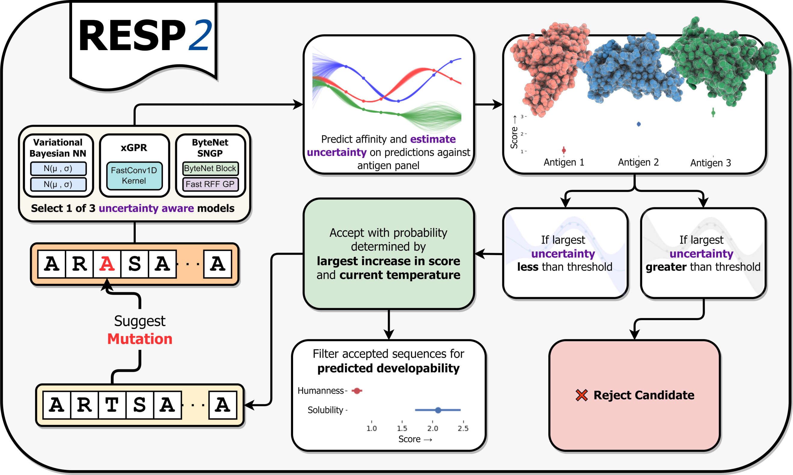

# RESP2



This repo contains the code for the `resp_protein_toolkit` package. It also contains all
of the code needed to reproduce key experiments from Parkinson / Hard, Ko and Wang 2024.

# Using resp_protein_toolkit

`resp_protein_toolkit` contains tools for key tasks in protein
engineering. It provides fast tools for quickly encoding protein
sequences using some common simple encodings (substitution matrices,
one-hot encoding and integer encoding); uncertainty-aware deep learning
models for classification and regression that you can train on your own
data; and software tools to perform the RESP *in silico* optimization
on your own sequences against your own targets. You can use
`resp_protein_toolkit` to perform all the tasks required for RESP
optimization against a target of interest.

### Installation
```
pip install resp_protein_toolkit
```
The toolkit is prebuilt for most common platforms but will automatically
be compiled from source for more unusual platforms.

### Usage

[The documentation](https://resp-protein-toolkit.readthedocs.io/en/latest/)
contains details on how to use `resp_protein_toolkit` together with examples
in the form of jupyter notebooks.


# Reproducing experiments from the RESP2 paper

We anticipate that most end users are likely more interested in using the RESP
pipeline for their own data -- if this describes you, see the `resp_protein_toolkit`
section above. If however you are interested *specifically* in reproducing the
experiments from the RESP2 paper, you can use the code in this repo to do so as well
by using the command line interfaces under `run_experiments.py` and under
`absolut_experiments/run_absolut_experiments.py`. These command line interfaces
enable you to reproduce the experiments from the paper in a step-by-step fashion,
first downloading the raw data, then encoding it, then training models on it
and reporting model evaluation results.

### Installation

These experiments were originally run on a Nvidia A6000 GPU with cuda12.3.

To run this package, first clone it:
```
git clone https://github.com/Wang-lab-UCSD/covid_experiments/
cd covid_experiments
```

then create a suitable virtual environment, activate it and install the requirements:
```
pip install -r requirements.txt
```
then install two additional packages:

```
pip install git+https://github.com/jlparkI/uncertaintyAwareDeepLearn@0.0.5
pip install git+https://github.com/jlparkI/xGPR@0.2.0.5
```

Note: the experiments in this repo were run with an older version of xGPR, v0.2.0.5. The older
version is slower and somewhat harder to install than later versions -- the most recent version is
distributed on pypi as a wheel whereas older versions are not -- so we recommend using later versions
(>0.4.0.1) for new projects. The difference in outcome should be negligible; nontheless to reproduce
the experiments here exactly as they were run initially you should use v0.2.0.5 as illustrated above.

These experiments were run with cuda runtime 12.1 locally installed and with cuSOLVER version 11.3.2.

### Reproducing the SARS-Cov2 experiments

To reproduce the SARS-Cov2 experiments from the paper, from the command line, run:
```
python run_experiments.py
```

and you'll see a list of options:
```
usage: run_experiments.py [-h] [--encodeall] [--traintest] [--traintest_llgp] [--id_key_positions] [--evolution] [--evanal]

Use this command line app to run key experiments. Note that this may overwrite the existing results saved in this repo.

options:
  -h, --help          show this help message and exit
  --encodeall         Encodes the amino acid sequence data which is included with the repository. This data contains the sequencing
                      results for the SARS-Cov2 experiments together with the frequency with which each sequence was observed both
                      in the naive library and in the binding bin for each antigen. The encoded data is divided into training and
                      test sets. It contains a variety of encodings (to evaluate the performance of each on the test set) and the
                      calculated enrichment scores for each datapoint, where enrichment is a proxy for binding. The encoded data is
                      saved to the encoded_data folder.
  --traintest         Run train-test evaluations on all models used in the paper, EXCEPT for the SNGP / LLGP. Each model is trained
                      on training set data from the encoded_data folder then evaluated on the test set in the same location. Test
                      set accuracy is saved to results_and_resources/traintest_log.rtxt.
  --traintest_llgp    Run train-test evaluations on the SNGP / LLGP model. This step is identical to --traintest but runs the
                      evaluation for the SNGP / LLGP model only. Since this model is slower to train it is split into a separate
                      step.
  --id_key_positions  This step can be run once models have been trained. In this step, the trained GP model is used to find the
                      most important positions for in-silico search, and these positions are printed to screen.
  --evolution         This step can be run once models have been trained. It uses the trained xGPR / GP model to run the RESP search
                      described in the paper and generate candidates for experimental evaluation. The candidates that are generated
                      are saved to a pickled file under results_and_resources/simulated_annealing.
  --evanal            Analyze the simulated annealing results, discarding problematic candidates to retain only the most promising
                      ones. This step should be run after --evolution since it uses the output of the --evolution step. The final
                      candidates selected for experimental evaluation are saved to results_and_resources/selected_sequences.                                                                                                                
```

For the SARS-Cov2 experiments, the raw data needed to run the remaining experiments
is already included with the repo, although it must be encoded using `--encodeall`
before running the subsequent steps. The subsequent steps will train models on
the encoded raw data and then conduct the RESP optimization sequence to
generate candidates. Each subsequent step is described in detail above. The raw data
for these experiments consists of amino acid sequences together with the frequency
with which each sequence appeared in the naive library and in the binding bin
for each antigen of interest.

Note that to ensure maximum reproducibility the SNGP / LLGP model is run using torch.use_deterministic_algorithms
set to True. This may cause an error unless certain environment variables are set. When running the traintest_llgp
experiment, then, you should first run the following line:
```
export CUBLAS_WORKSPACE_CONFIG=:4096:8
```

### Reproducing the Absolut! synthetic data experiments

The paper also describes experiments on synthetic data from the
[Absolut! database](https://github.com/csi-greifflab/Absolut).

To reproduce these experiments, do the following:
```
cd absolut_experiments
python run_absolut_experiments.py
```

and you will see a list of options as follows:

```
usage: run_absolut_experiments.py [-h] [--retrieve_data] [--encode_data] [--nmll] [--run_test_split] [--run_resp_search]
                                  [--evaluate_resp_candidates]

Use this command line app to run key experiments.

options:
  -h, --help            show this help message and exit
  --retrieve_data       Retrieve the raw data from the Absolut database and save it to the absolut_data folder. This step must be
                        performed before any other steps.
  --encode_data         Encode the retrieved absolut data, encoding all protein sequences as either one-hot or substitution
                        matrices, create a train-test split and save the training and test encoded sequences as .npy files under the
                        absolut_encoded_data folder. Also extracts 90th percentile and 80th percentile sequences to the same
                        location for use in fine-tuning LLMs. These are required for all subsequent steps.
  --nmll                Calculates the negative marginal log-likelihood on the training data for xGPR. This step is not required but
                        can be used to reproduce the hyperparameter tuning procedure originally used for xGPR if desired. The
                        results are printed to screen.
  --run_test_split      Trains xGPR and vBNN models on the training data from absolut_encoded_data and tests them on the test set in
                        the same location. The results of the test set evaluation are written to absolut_results/traintest_log.rtxt,
                        and the trained models are saved to absolut_results for use in subsequent steps.
  --run_resp_search     Generate candidate sequences using the RESP search with the final trained models. The resulting candidate
                        sequences will be saved to the 'absolut_results' folder under files ending in .rtxt; these files can be used
                        as input to Absolut! for scoring. To score these sequences you will need to download and install the
                        Absolut! software package; see https://github.com/csi-greifflab/Absolut for instructions on how to do so.
  --evaluate_resp_candidates
                        Once the candidate sequences have been scored using Absolut!, move the Absolut! output to the
                        'absolut_results/absolut_scores' folder, then use this argument to evaluate these scores and calculate /
                        print success rates for each model and target; the results are printed to screen.
```

These commands are sufficient to reproduce all key steps in the pipeline,
starting from raw data download, and are described in detail above.

The candidates generated by the fine-tuned Evodiff LLM (from Microsoft) and
ProteinMPNN (from the Baker lab) are already saved under
`absolut_experiments/absolut_results/absolut_scores`. If you would like to
fine-tune Evodiff and generate your own candidates using Evodiff, see this
fork of the Evodiff repo for instructions: https://github.com/jlparkI/evodiff_ft.
This is a lightly altered fork of Microsoft's Evodiff repo with only minor changes
intended to facilitate fine-tuning for this project. If you would like to
use ProteinMPNN to generate candidates, see the ProteinMPNN repository:
https://github.com/dauparas/ProteinMPNN . It is beyond the scope of this
repository to cover Evodiff and ProteinMPNN in detail we do not maintain
these models and they are neither part of this package nor the standard
RESP pipeline, but the two repositories linked above will guide you on how
to use them if needed.


### Citations

If using this toolkit in work intended for publication, please cite:

[Parkinson, J., Hard, R. & Wang, W. The RESP AI model accelerates the identification of tight-binding antibodies.
Nat Commun 14, 454 (2023).](https://doi.org/10.1038/s41467-023-36028-8)
